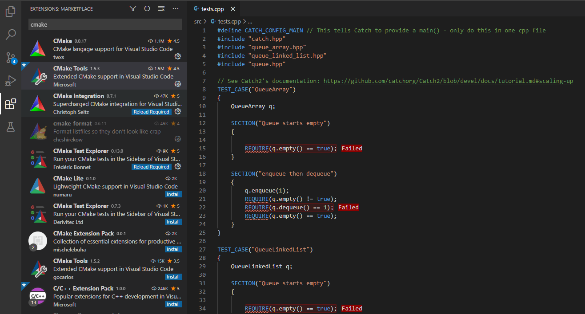

# 270191U025-Software-Architecture-assignment-template

## ONLY FOR TEACHERS (REMOVE THIS FROM ASSIGNMENT)

This repository contains a template for C++ based assignements in the 'Software Architecture' course.
The template provides a CMake-based build system that makes it easy that makes it easy to build and test the students code.

The intention is to use this template as the seed project to several other repos, specifically one for each assignment in the course.
An assignement in GitHub classroom provides the students with the appropriate files.

To detect tampering with the grading file calculate the md5 checksum. The most portable way of doing this is using python:

```bash
python -c "import hashlib; print(hashlib.md5(open('autograde.py','rb').read()).hexdigest())"
```

The md5 checksum should be: `3fb245f0f15bf8b4aeb34e9b5adc1289` -- if it is not then the file has been modified, which may or may not be intentional.

## Assignment

In this exercise you will:

1. Install Git and learn how to clone a repository
2. Define an interface to a stack using an abstract class in C++, and create an implementation based on:
   - array
   - linked list
3. Test your implementation against test suite
4. Submit your assignment using Git

### Familiarize youself with Git

Git is a version control system that is used extensively in software development, that allows you to store code while maintaining a history of changes made previously.
GitHub is a popular service that hosts repositories and provides additional services.

The first part of this exercise is to install and familiarize yourself with git to a point where you can download the assignment template and subsequently submit the finished assignment through Git.
There are countless guides online on how to install and use Git, one of them being:

- [Text Based Guide](https://guides.github.com/introduction/git-handbook/)

- [Video](https://www.youtube.com/watch?v=SWYqp7iY_Tc)

Clone the repository and code away :)

### Repository Structure

For each handin you are provided a set of files that help you get started with the assignment.
These serve as a template for the assignment.

The two directories are:

1. include: Contains C++ header files
2. src: include C++ source files

The files are:

1. CMakeLists.txt: build script similar to a makefile, but cross-platform
2. autograde.py: python script for building and grading your submission
3. .gitignore: defines which types of files should not be tracked by Git

### Install VSCode CMake integration (Optional)

You may install an integration in VSCode that makes it easier to build and debug you code.
The 'CMake' and 'CMake Tools' are recommended.



### Implementing an abstract class

Having cloned the repository you are now ready to define the abstract and implement the abstract class.

1. Look at the definition of the abstract class found in `queue.hpp`. Make sure that you understand the significance of the `virtual` and `=0` keywords.

```cpp
class Queue
{
public:
    virtual void enqueue(int value) = 0;
    virtual int dequeue() = 0;
    virtual bool empty() const = 0;
    virtual bool full() const = 0;
};
```

2. Implement the class using an integer array, see `queue_array.hpp`.

3. Implement the class using an integer list, see `queue_linked_list.hpp`.

### Running Tests and Grading

Your grade is based on your code passing the provided tests.
You can run the test by running the following command in the root of your project:

```bash
python autograde.py

...
INFO:.\autograde.py:
#######################################################################################################
Final grade is: 0

grade = test_passed_fraction* 70 + memory_check_passed * 20 + static_analysis_passed * 10
0 = 0% * 70 + False * 20 + False * 10
#######################################################################################################
```

**Do not modify the script in any way, a checksum is used to check the integrity of the file. Incorrect checksum ⟹ no pass.**
